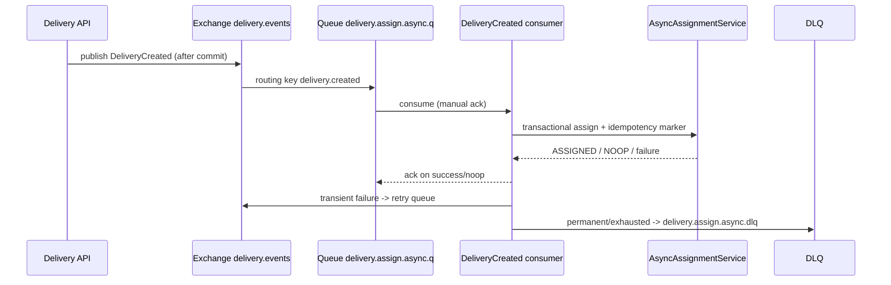

# Delivery Hub API (backend)

Spring Boot modular monolith for the Last Mile Delivery Marketplace. Bounded contexts are Java packages (not separate Maven modules). The **PostgreSQL** schema is owned by **Flyway** (`src/main/resources/db/migration`); Hibernate `ddl-auto` is `none` so SQL migrations and JPA stay aligned.

**Local machine runs** use the **`local`** profile by default (`spring.profiles.default=local` in `application.properties`). JDBC settings live in `application-local.properties` so the main file stays free of hardcoded credentials.

## Prerequisites

- **JDK** version matching `pom.xml` (`java.version`; currently **25**).
- **Apache Maven** 3.9+ (this repo does not include the Maven Wrapper).
- **PostgreSQL** when running the app on your machine — easiest path is **Docker** (see [Database](#database)). A locally installed PostgreSQL 15+ on `localhost:5432` is fine if you create the same database and user.

## Database

### Why it matters

The application does not start without a reachable datasource when the **`local`** profile is active (the default for `spring-boot:run`). If PostgreSQL is stopped, startup fails with a connection error. That is expected.

### Option 1: Docker (recommended)

From this directory (`backend/`):

```bash
docker compose -f docker/docker-compose.yml up -d
```

This starts PostgreSQL **18** with:

| Setting | Value |
|--------|--------|
| Host (from your machine) | `localhost` |
| Port | `5432` |
| Database | `deliveryhub` |
| User / password | `deliveryhub` / `deliveryhub` |

To stop and remove the container (data kept in the named volume):

```bash
docker compose -f docker/docker-compose.yml down
```

### Option 2: Local PostgreSQL

Create a database and role matching the defaults above, or override the datasource with environment variables (next section).

### Datasource environment variables

Defaults for the **`local`** profile are in `src/main/resources/application-local.properties`. Override with standard Spring Boot properties — for example:

| Variable | Example |
|----------|---------|
| `SPRING_DATASOURCE_URL` | `jdbc:postgresql://localhost:5432/deliveryhub` |
| `SPRING_DATASOURCE_USERNAME` | `deliveryhub` |
| `SPRING_DATASOURCE_PASSWORD` | `deliveryhub` |

Do not commit real production credentials; use secrets or your host’s environment configuration.

### Resetting development data

**Docker (removes container and volume — all DB data is lost):**

```bash
docker compose -f docker/docker-compose.yml down -v
docker compose -f docker/docker-compose.yml up -d
```

**Same database, SQL only (destructive):** connect with `psql` or a GUI and run:

```sql
DROP SCHEMA public CASCADE;
CREATE SCHEMA public;
```

Then restart the application so Flyway reapplies migrations from scratch.

### Confirming Flyway

After a successful startup against an empty database, Flyway creates `flyway_schema_history` and applies versioned scripts. To verify:

```sql
SELECT * FROM flyway_schema_history ORDER BY installed_rank;
```

You should see applied migrations (for example version `1` for `V1__init.sql`).

## Run locally

1. Start PostgreSQL (see [Database](#database)).
2. From this directory:

```bash
mvn spring-boot:run
```

The **`local`** profile is active by default, so no extra `-Dspring-boot.run.profiles=local` is required unless you changed `spring.profiles.default`.

The API listens on **port 8080** (see `src/main/resources/application.properties`).

## Build

Compile and package the application:

```bash
mvn -q package
```

## Verify

With the app running, check actuator health:

```bash
curl -s http://localhost:8080/actuator/health
```

Expected JSON includes `"status":"UP"`.

## Security note

JWT Bearer authentication is enforced for routes outside `/auth/**` and `/actuator/health`. Tokens are issued at login (`POST /api/auth/login`) and carry `sub` (user id) plus a `role` claim so `@PreAuthorize` can distinguish roles.

## Delivery create payload (POST `/api/deliveries`)

The create endpoint accepts the simplified frontend request shape:

- `pickup`: `line1`, `contactName`, `contactPhone`
- `destination`: `line1`, `contactName`, `contactPhone`
- `package`: `weightKg`, `description`
- `deliveryType`, `specialInstructions`
- `pricing`: `baseAmount`, `feeAmount`, `taxAmount`, `totalAmount`, `currency`

Pricing ownership is client-side for this flow: backend validates the pricing snapshot and persists it directly to `deliveries` (`base_amount`, `fee_amount`, `tax_amount`, `total_amount`, `currency`) without server-side recalculation.

## Delivery list payload (GET `/api/deliveries`)

List rows include route-friendly address fields in camelCase:

- `destinationLine1` (main route text)
- `pickupLine1` (route hint, e.g. "from ...")

**Idempotency:** duplicate POSTs create separate deliveries (GitHub #31).

## Courier available deliveries (GET `/api/deliveries/available`)

Courier role only (`ROLE_COURIER`). Returns a paged list of assignable deliveries:

- only `CREATED` rows
- only unassigned rows (`courier_id IS NULL`)
- optional filter: `deliveryType=STANDARD|EXPRESS`
- supports pageable query params (`page`, `size`, `sort`)

Response rows include:

- identity/status: `id`, `status`, `deliveryType`
- route summary: `pickupLine1`, `destinationLine1`
- pricing snapshot: `baseAmount`, `feeAmount`, `taxAmount`, `totalAmount`, `currency`
- placeholders for future matching signals: `distanceKm`, `etaMinutes` (`null` in current implementation)

## Courier accept delivery (POST `/api/deliveries/{id}/accept`)

Courier role only (`ROLE_COURIER`). Accept is transactional and concurrency-safe using a pessimistic row lock (`PESSIMISTIC_WRITE`) on the selected delivery:

- acquires lock on delivery row by id
- re-checks assignable conditions under lock (`status=CREATED`, `courier_id IS NULL`)
- sets assignment atomically (`courier_id=current courier`, `status=ASSIGNED`)
- appends `ASSIGNED` entry in `delivery_status_history` in the same transaction

Conflict semantics:

- returns `409 Conflict` with RFC 7807 payload and stable machine code `DELIVERY_TAKEN` when another courier already claimed the delivery or it is no longer assignable
- returns `404` when delivery id does not exist

## Delivery status snapshot (GET `/api/deliveries/{id}/status`)

Compact polling endpoint for tracking and WS fallback:

- response fields: `status`, `etaMinutes`, `updatedAt`, `progressPercent`
- ownership semantics are identical to `GET /api/deliveries/{id}`
- includes `ETag` so clients can use `If-None-Match` and receive `304 Not Modified` when unchanged

Polling methodology and curl baseline loop are documented in `docs/polling-tracking-baseline.md`.

## Notifications API (`#46`)

Customer notifications persistence and read-state endpoints are available with strict user scoping (no client-provided `userId`):

- `GET /api/notifications` with `page`, `size`, `sort`, `unreadOnly`, `type`
- `PATCH /api/notifications/{id}/read` for idempotent mark-read
- `PATCH /api/notifications/read-all` returning `{ "updatedCount": <number> }`

Full contract and examples are documented in `docs/notifications-api.md`.

## Notification emitters (`#47`)

Delivery assignment and milestone status transitions now emit `NotificationRequested` domain events from transactional delivery flows (`accept` + `PATCH status`), and notifications are handled in an `AFTER_COMMIT` listener to avoid rolling back delivery updates on notification failures. In the current API scope, emitted recipients are customer-only.

Runtime mode is controlled by properties:

- `notifications.async.enabled=false` (default): listener persists notification rows synchronously.
- `notifications.async.enabled=true`: listener publishes event payload to RabbitMQ (`notifications.async.exchange` + `notifications.async.routing-key`).
- `notifications.async.fallback-to-sync=true`: if async publish fails, listener falls back to sync persistence.

## Async assignment consumer (`#68`)

Delivery creation now publishes a versioned `DeliveryCreated` event after transaction commit (feature-flagged), and RabbitMQ consumer-based assignment can process the event asynchronously with idempotency + retry + DLQ flow.

Sequence:



Main properties:

- `delivery.assignment.async.enabled` - publishes `DeliveryCreated` events when deliveries are created.
- `delivery.assignment.async.consumer-enabled` - toggles Rabbit listener startup.
- `delivery.assignment.async.max-retries` - bounded retry attempts before DLQ handoff.
- `delivery.assignment.async.retry-backoff-millis` - retry delay schedule in milliseconds.
- `delivery.assignment.async.queue` / `retry-queue` / `dlq` - queue names for main retry and DLQ paths.
- `delivery.assignment.async.exchange` / `routing-key` / `retry-routing-key` / `dlx` / `dlq-routing-key` - exchange/routing topology.

## Admin user management APIs (`#54`)

Admin-only endpoints for managing courier/customer accounts:

- `GET /api/admin/couriers` and `GET /api/admin/customers`
- `POST /api/admin/couriers` and `POST /api/admin/customers`

List behavior:

- pageable contract (`page`, `size`, `sort`)
- optional search (`q` or `search`) over `email`, `displayName`, `phoneNumber`
- deterministic sorting (requested sort + `id DESC` tie-breaker; default `createdAt DESC`)

Create behavior:

- validates `email`, `displayName`, and password complexity
- stores password as BCrypt hash (never returned in responses)
- duplicate email returns `409` with `code=USER_EMAIL_CONFLICT` and `fieldErrors.email`
- courier creation also creates a `courier_profiles` row in the same transaction

Current onboarding assumption for MVP:

- admin submits an initial password in create payloads
- invite/reset-password workflow is deferred to a later milestone

## Admin reports APIs (`#57`)

Admin-only analytics endpoints are available under `/api/admin/reports`:

- `GET /deliveries-by-status`
- `GET /revenue`

Shared query contract:

- required `from` and `to` (`ISO-8601` timestamp or `YYYY-MM-DD`)
- optional `granularity=day|week` (defaults to `day`)
- UTC-normalized aggregation buckets on the backend
- max window enforced to `180` days (validation error when exceeded)

## Courier earnings APIs (`#58`)

Courier-only earnings visibility endpoints are available under `/api/couriers/me/earnings`:

- `GET /summary`
- `GET /entries`

The current MVP uses a **derived** earnings model (no dedicated ledger table yet):

- earning entries are derived from `DELIVERED` rows in `delivery_status_history` joined with `deliveries`
- entry timestamp is `delivery_status_history.recorded_at` (UTC semantics)
- amount source is `deliveries.total_amount`

Shared query semantics:

- optional `from` and `to` (`ISO-8601` timestamp or `YYYY-MM-DD`)
- when provided, `from` and `to` must be sent together
- max range is `180` days
- range boundaries are interpreted in UTC (date-only `to` is treated as end-of-day exclusive)

Summary payload includes:

- `todayTotal`, `weekTotal`, `monthTotal`
- `customRangeTotal` and `trend` (vs previous period with same span)
- UTC `window` metadata and daily chart buckets (`chartPoints`)
- `currency` (dominant delivered currency for the selected window, fallback `RON`)

Entries payload:

- paginated rows with deterministic default sort (`recordedAt,desc`)
- fields: `deliveryId`, `trackingCode`, `amount`, `currency`, `status`, `earnedAt`, optional `note`
- no customer-sensitive fields are exposed
